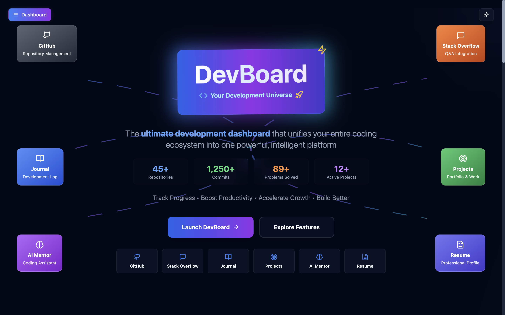

# DevBoard - Personal Developer Dashboard

🚀 **Personal Dev Dashboard for GitHub + StackOverflow + Blogs + Logs**

A comprehensive, modern developer dashboard for tracking your coding journey, managing projects, and accelerating your growth. Built with React.js, Next.js, Node.js, GraphQL, and MongoDB.



## 🚀 Features

### 📊 **Dashboard & Analytics**
- **Real-time Activity Tracking**: Monitor your coding activities, commits, and progress
- **Productivity Metrics**: Track learning hours, productivity scores, and development trends
- **Visual Analytics**: Beautiful charts and graphs to visualize your coding journey
- **Goal Setting**: Set and track personal development goals

### 📝 **Developer Journal**
- **Daily Entries**: Record your thoughts, learnings, and challenges
- **Mood Tracking**: Monitor your emotional state and productivity correlation
- **Learning Logs**: Document new concepts and technologies learned
- **Achievement Tracking**: Celebrate your wins and milestones

### 🎯 **Project Management**
- **Project Tracker**: Manage personal and professional projects
- **Progress Monitoring**: Track project completion and milestones
- **Technology Stack**: Document tech stacks and dependencies
- **GitHub Integration**: Sync with your GitHub repositories

### 📄 **AI-Powered Resume Builder**
- **Smart Resume Generation**: AI-assisted resume creation and optimization
- **Multiple Templates**: Professional templates for different industries
- **Export Options**: PDF, Word, and HTML formats
- **Real-time Preview**: See changes as you make them

### 🔍 **Open Source Contribution Finder**
- **Issue Recommendations**: Find GitHub issues matching your skills
- **Difficulty Filtering**: Filter by beginner, intermediate, or advanced level
- **Language Filtering**: Find issues in your preferred programming languages
- **Contribution Tracking**: Track your open source contributions

### 🤖 **AI Mentor & Assistant**
- **Code Review**: Get AI-powered code reviews and suggestions
- **Learning Guidance**: Personalized learning path recommendations
- **Problem Solving**: Get help with debugging and algorithm optimization
- **Career Advice**: AI-powered career guidance and mentorship

### 🏆 **Code Challenges & Practice**
- **Daily Challenges**: Solve coding challenges to improve skills
- **Multiple Languages**: Support for various programming languages
- **Difficulty Levels**: From beginner to expert level challenges
- **Performance Tracking**: Monitor your problem-solving progress

### 📱 **Integrations**
- **GitHub**: Sync repositories, commits, and pull requests
- **Stack Overflow**: Track your Q&A activity and reputation
- **LinkedIn**: Professional profile integration
- **VS Code Extension**: (Coming Soon) IDE activity tracking

### 🔐 **Privacy & Security**
- **Secure Authentication**: JWT-based authentication system
- **Data Privacy**: Control what data is public or private
- **Export Options**: Export all your data anytime
- **Account Management**: Full control over your account and data

## 🔧 Tech Stack

### Frontend
- **React.js** + **Next.js** - Modern React framework with SSR/SSG
- **Tailwind CSS** + **shadcn/ui** - Beautiful, responsive UI components
- **TypeScript** - Type-safe development

### Backend
- **Node.js** + **Express** - Server runtime and web framework
- **GraphQL** (Apollo Server) - Flexible API layer
- **TypeScript** - Type-safe backend development

### Database & Cache
- **MongoDB** - Document database for user data and history
- **Redis** - Caching layer for GitHub API responses
- **Kafka** - Event streaming for activity tracking

### AI & Integrations
- **OpenAI GPT** - AI-powered summaries and recommendations
- **GitHub API** - Repository and activity data
- **Stack Overflow API** - Discussion and Q&A integration
- **VS Code Extension** - Local IDE integration

## 📊 Core Features

### 1. **AI-Based Coding Activity Analysis**
- Visual heatmaps and graphs of GitHub commits, PRs, issues
- Weekly impact summaries powered by GPT
- Cross-repository activity tracking

### 2. **Auto-Journal: Developer Diary**
- AI-generated daily/weekly development journals
- Integration with GitHub, StackOverflow, and VS Code logs
- Automatic highlight extraction

### 3. **Smart Resume Builder**
- Dynamic resume generation from GitHub contributions
- Tech stack frequency analysis
- Blog post and project integration
- PDF and Markdown export

### 4. **Open Issue Recommender**
- Personalized open-source issue recommendations
- GPT-powered issue explanations and solution approaches
- Integration with GoodFirstIssue.dev

### 5. **AI Career Mentor**
- Goal-based project and resource recommendations
- Personalized nudges and growth suggestions
- Learning path optimization

## 🌍 Integration Features

### 6. **Stack Overflow & Reddit Digest**
- Weekly tech stack discussion summaries
- AI-powered answer extraction
- Trending topic tracking

### 7. **Tweet & Blog Generator**
- AI-suggested content from commit activity
- Draft generation for social media
- Publishing automation

### 8. **VS Code Plugin Integration**
- Local IDE activity tracking
- Coding time and error analysis
- Pomodoro timer integration

### 9. **Productivity Leaderboard**
- Friend/team activity comparison
- Gamification with XP system
- Achievement badges

### 10. **Project Portfolio Dashboard**
- Comprehensive project tracking
- GitHub stars and activity monitoring
- AI-powered project audits

## 🛠️ Advanced Features

- **Daily Code Challenge Widget** - Personalized coding prompts
- **API Testing Playground** - Built-in Postman-like tester
- **Security & Quality Monitor** - Repo security scanning
- **Work Showcase Generator** - Public developer profile

## 🚀 Getting Started

1. **Install dependencies:**
   ```bash
   npm run install:all
   ```

2. **Set up environment variables:**
   ```bash
   cp .env.example .env
   # Edit .env with your API keys
   ```

3. **Start development servers:**
   ```bash
   npm run dev
   ```

4. **Access the application:**
   - Frontend: http://localhost:3000
   - Backend: http://localhost:4000
   - GraphQL Playground: http://localhost:4000/graphql

## 📁 Project Structure

```
devboard/
├── frontend/          # Next.js React application
├── Backend/           # Node.js GraphQL API
├── shared/            # Shared types and utilities
├── docs/              # Documentation
├── scripts/           # Build and deployment scripts
└── docker-compose.yml # Local development setup
```

## 🔧 Development

### Prerequisites
- Node.js 18+
- MongoDB (local or Atlas)
- Redis (local or cloud)
- GitHub API token
- OpenAI API key

### Environment Variables
```bash
# Database
MONGODB_URI=mongodb://localhost:27017/devboard
REDIS_URL=redis://localhost:6379

# APIs
GITHUB_TOKEN=your_github_token
OPENAI_API_KEY=your_openai_key
STACKOVERFLOW_API_KEY=your_so_key

# Auth
JWT_SECRET=your_jwt_secret
```

## 🚀 Deployment

### Free Tier Options
- **Frontend**: Vercel, Netlify, or Render
- **Backend**: Railway, Render, or Heroku
- **Database**: MongoDB Atlas (free tier)
- **Cache**: Upstash Redis (free tier)

### Production Setup
```bash
npm run build
npm run start
```

## 🤝 Contributing

1. Fork the repository
2. Create your feature branch (`git checkout -b feature/amazing-feature`)
3. Commit your changes (`git commit -m 'Add some amazing feature'`)
4. Push to the branch (`git push origin feature/amazing-feature`)
5. Open a Pull Request

## 📄 License

This project is licensed under the MIT License - see the [LICENSE](LICENSE) file for details.

## 🙏 Acknowledgments

- OpenAI for GPT integration
- GitHub for comprehensive API
- The open-source community for inspiration

---

**Built with ❤️ for developers, by developers**
